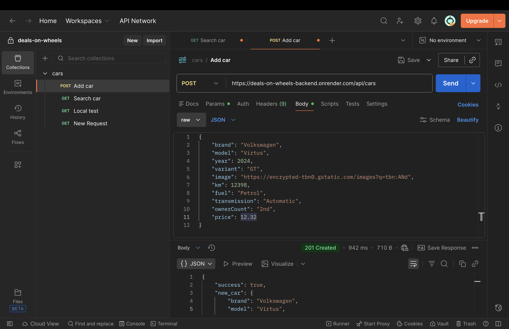
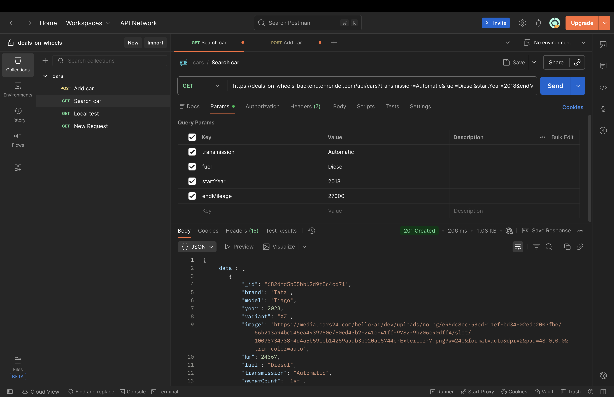

# Deals On Wheels — Backend API Documentation

This document describes the backend API for **Deals On Wheels**.
The API is responsible for storing and querying used car listings. The API was built using **Node.js + Express** and is
backed by **MongoDB** using **Mongoose**.

---

## 🌐 Base URL

### Local Development
```
http://localhost:<PORT>/api/cars
```

---

## 📄 Car Schema

Each car listing stored in the database follows this schema:

| Field          | Type   | Description                               |
|---------------|--------|-------------------------------------------|
| `brand`        | String | Car manufacturer                          |
| `model`        | String | Car model                                |
| `year`         | Number | Manufacturing year                       |
| `variant`      | String | Variant / trim                           |
| `image`        | String | Image URL                                |
| `km`           | Number | Mileage (in kilometers)                  |
| `fuel`         | String | Fuel type (Petrol / Diesel / etc.)       |
| `transmission` | String | Manual / Automatic                      |
| `ownerCount`   | String | Number of previous owners                |
| `price`        | Number | Price (supports decimal values)          |
| `createdAt`    | Date   | Auto-generated timestamp                 |
| `updatedAt`    | Date   | Auto-generated timestamp                 |

> All fields are required.

---

## ➕ Add a Car Listing

Create a new car entry in the database.

### Endpoint
```
POST /api/cars
```

### Request Body
```json
{
  "brand": "Honda",
  "model": "City",
  "year": 2019,
  "variant": "VX",
  "image": "https://example.com/car.jpg",
  "km": 42000,
  "fuel": "Petrol",
  "transmission": "Manual",
  "ownerCount": "1st",
  "price": 4.22
}
```

### Success Response
```json
{
  "success": true,
  "new_car": {
    "_id": "64f1xxxxxxxx",
    "brand": "Honda",
    "model": "City",
    "year": 2019,
    "variant": "VX",
    "image": "https://example.com/car.jpg",
    "km": 42000,
    "fuel": "Petrol",
    "transmission": "Manual",
    "ownerCount": "1st",
    "price": 4.22,
    "createdAt": "2024-01-01T10:00:00.000Z",
    "updatedAt": "2024-01-01T10:00:00.000Z"
  }
}
```

---

## 📥 Get Car Listings (With Filters)

Fetch car listings with optional server-side filters.

### Endpoint
```
GET /api/cars
```

### Supported Query Parameters

| Parameter        | Description                          |
|------------------|--------------------------------------|
| `brand`          | Filter by brand                      |
| `model`          | Filter by model                      |
| `transmission`   | Automatic/Manual                     |
| `variant`        | Filter by variant                    |
| `fuel`           | Filter by fuel type                  |
| `minPrice`       | Minimum price                        |
| `maxPrice`       | Maximum price                        |
| `startYear`      | Minimum manufacturing year           |
| `endYear`        | Maximum manufacturing year           |
| `startMileage`   | Minimum mileage (km)                 |
| `endMileage`     | Maximum mileage (km)                 |

All parameters are optional and can be combined.

### Example Request
```
GET /api/cars?brand=Skoda&minPrice=3.5&maxPrice=8&startYear=2018
```

### Example Response
```json
{
  "data": [
    {
      "brand": "Skoda",
      "model": "Kushaq",
      "year": 2022,
      "variant": "Ambition",
      "km": 32000,
      "fuel": "Petrol",
      "transmission": "Manual",
      "ownerCount": "3rd",
      "price": 7.85
    }
  ]
}
```

---

## API Preview (Postman)

- POST endpoint used to add cars to DB
  <p align="center"></p>
- GET endpoint used to fetch cars from DB
  <p align="center"></p>

---

## 📝 Notes

- All filters are applied server-side using MongoDB queries.
- Numeric fields support decimal values (e.g. `4.22`).
- The API is currently open as part of MVP scope.
- Designed for consumption by the frontend and testing via Postman.
